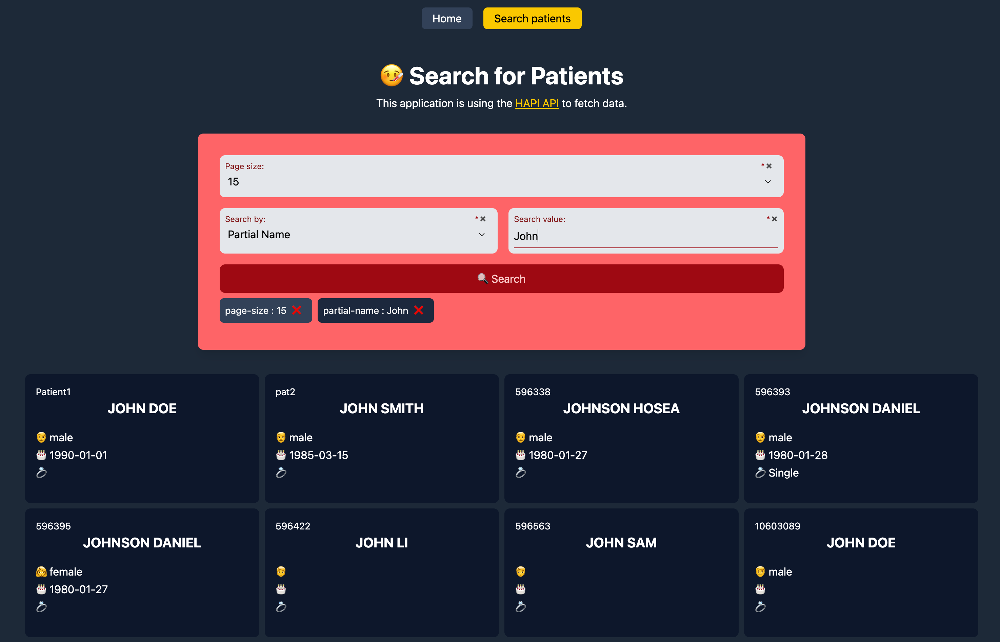

# FHIR Playground



See [this (about)](https://www.hl7.org/fhir/) and [this (API)](https://hapi.fhir.org/baseR4).

Fast Healthcare Interoperability Resources (FHIR) is a healthcare data standard with an API for representing and exchanging electronic health records (EHR). FHIR is an information network that lets you link data across systems and a communication network that lets you exchange data between systems.

## Why this Project?

This project is a playground for me to learn about FHIR and to experiment with the data. I am interested in the following:

- How to represent FHIR data in Clojure
- How to query FHIR data
- How to transform FHIR data
- How to visualize FHIR data

## Polylith Workspace

The Polylith documentation can be found here:

- The [high-level documentation](https://polylith.gitbook.io/polylith)
- The [poly tool documentation](https://cljdoc.org/d/polylith/clj-poly/CURRENT)
- The [RealWorld example app documentation](https://github.com/furkan3ayraktar/clojure-polylith-realworld-example-app)

You can also get in touch with the Polylith Team on [Slack](https://clojurians.slack.com/archives/C013B7MQHJQ).

## Get Started

Get Tailwind cracking on the CSS:

```bash
./run-css
```

Run your figwheel and server REPLs either by jacking-in or by running

```bash
./run-server
./run-webapp
```

## License

Copyright © 2025 Clarice Bouwer

Distributed under the Eclipse Public License either version 1.0 or (at your option) any later version.
